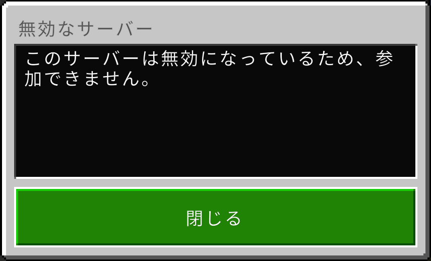
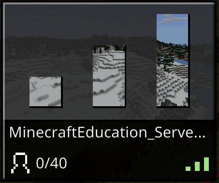
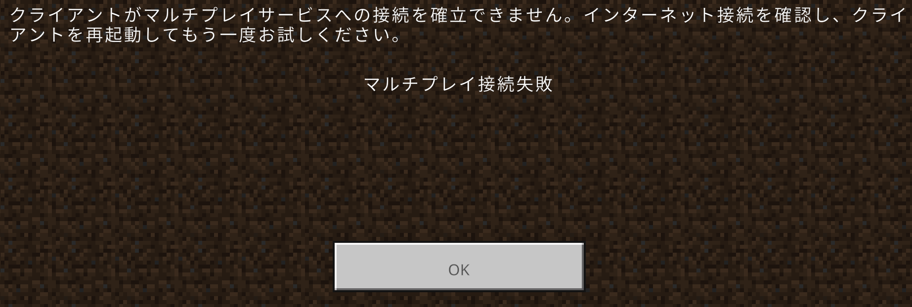

# Minecraft Education Edition Dedicated Server - Docker

English | [日本語](README.md)

Run Minecraft Education Edition Dedicated Server in a fully compliant environment following official configuration guidelines.

> **Note**: This server uses v1.21.110 beta version.

## System Requirements

- Docker & Docker Compose
- 2+ CPU cores
- 1GB+ RAM
- Azure AD Global Administrator privileges (required for initial authentication and server management)

## Setup

```bash
# 1. Build
docker-compose build

# 2. Start
docker-compose up -d

# 3. Authentication (first time only)
docker-compose logs -f minecraft-edu
# Follow the code and URL shown in logs for browser authentication
# After authentication, the Server ID (12-character alphanumeric) will be displayed
```

### Important Information After First Startup

After authentication, the **Server ID** will be displayed in the logs. This ID is required for:
- Client connections
- Server management tool configuration

How to check Server ID:
```bash
# Check in logs
docker-compose logs minecraft-edu | grep "Server ID"

# Or check in edu_server_session.json
cat edu_server_session.json
```

## Directory Structure
```
minecraft-education-server-docker/
├── Dockerfile                    # Based on Ubuntu 22.04
├── docker-compose.yml           # Container configuration
├── entrypoint.sh                # Startup script (with auto-generation logic)
├── .env                         # Environment variables (manages all settings)
├── edu_server_session.json      # Auth session (empty initially, auto-generated after auth)
├── allowlist.json               # Whitelist (editable on host)
├── permissions.json             # Permissions (editable on host)
├── packetlimitconfig.json       # Packet limit config (editable on host)
├── README.md                    # Documentation (Japanese)
└── README.en.md                 # This file

# Created automatically on Docker startup
└── worlds/                      # World data (persisted)

# Auto-generated inside container by entrypoint.sh
└── server.properties            # Server configuration (generated from .env)
```

## Key Settings (.env)

### Server Basic Settings
```env
SERVER_PUBLIC_IP=                # Docker host IP address (LAN: 192.168.x.x, external: global IP/domain)
SERVER_PORT=19132                # IPv4 port
SERVER_PORTV6=19133             # IPv6 port
```

### Game Settings
```env
GAMEMODE=creative                # Game mode (survival/creative/adventure)
DIFFICULTY=easy                  # Difficulty (peaceful/easy/normal/hard)
MAX_PLAYERS=40                   # Maximum players
ALLOW_CHEATS=false              # Allow cheats
ALLOW_LIST=false                # Enable whitelist
CHAT_RESTRICTION=None           # Chat restriction (None/Dropped/Disabled)
```

### World Settings
```env
LEVEL_NAME=Education level        # World name
LEVEL_SEED=                     # World seed (empty for random)
VIEW_DISTANCE=32                # View distance (in chunks)
TICK_DISTANCE=4                 # Tick distance (4-12)
```

### Player Settings
```env
PLAYER_IDLE_TIMEOUT=30          # Idle timeout (minutes)
DEFAULT_PLAYER_PERMISSION_LEVEL=member  # Default permission (visitor/member/operator)
```

### Performance Settings
```env
MAX_THREADS=8                   # Maximum threads
TEXTUREPACK_REQUIRED=true       # Require texture pack
CONTENT_LOG_FILE_ENABLED=false  # Enable content logging
```

## Configuration System

### Centralized Management via .env
All settings are managed in the `.env` file. When the container starts:
1. `entrypoint.sh` reads environment variables
2. Dynamically generates/updates `server.properties`

### How to Change Settings
1. Edit the `.env` file
2. Restart the container: `docker-compose restart`

Environment variable values take precedence and are applied to server.properties at startup.

## Commands

```bash
# View logs
docker-compose logs -f minecraft-edu

# Restart
docker-compose restart

# Stop
docker-compose down

# Remove including volumes
docker-compose down -v
```

## Port Configuration

- **19132/udp**: IPv4 connections (default)
- **19133/udp**: IPv6 connections

Open both ports in your firewall.

## Important Notes

- **Azure AD authentication required on first startup** (Device Code authentication)
- `edu_server_session.json` is auto-generated after authentication and persisted
- All settings are managed in `.env` and automatically applied at startup
- No need to manually edit `server.properties` or other configuration files

## Troubleshooting

### Authentication Error
```bash
# Delete session file and re-authenticate
rm edu_server_session.json
docker-compose restart
```

### Performance Issues
Adjust the following in `.env`:
- `MAX_THREADS`: Adjust according to CPU cores
- `VIEW_DISTANCE`: Reduce to lower load
- `TICK_DISTANCE`: Adjust within 4-12 range

## Server Management

Basic game settings can be managed in `.env`, but advanced configurations require official tools:

### Management Tools (Required)

- **[IT Admin Portal](https://aka.ms/dedicatedservers)** - Tenant settings
  - Enable Dedicated Server feature
  - Enable Cross-Tenant Play

- **[Server Management Tool (Python Notebook)](https://aka.ms/MCEDU-DS-Tooling)** - Server detailed settings
  - Set server name
  - Passcode protection
  - Broadcast settings (auto-display to entire tenant)
  - Manage cross-tenant invitations

> **Note**: In the beta version, server name, passcode, and other settings can only be changed via Python Notebook or API. These will be configurable via Web Portal in the future.

### Server Activation (Important)

**Simply starting the server is not enough for clients to connect.** You must set `Enabled` to `True` in the Server Management Tool.

#### 1. Enter Server ID in Client


#### 2. Error When Enabled=False



Run the following in Server Management Tool (Python Notebook):
```python
# In tooling/edit_server_info cell
{
    "Enabled": True,  # Change this to True
    "ServerName": "My Education Server",
    "IsBroadcasted": False
}
```

#### 3. Connection Success After Enabled=True



#### 4. Port Configuration Issues

When port publishing or firewall settings are incorrect:



- Verify `SERVER_PORT` and `SERVER_PORTV6` are correctly set in `.env`
- Verify UDP ports (default 19132/19133) are open in firewall
- Verify port mapping with `docker-compose ps`

### Cross-Tenant Play

To enable multiplayer between multiple Azure AD tenants:
1. Enable Cross-Tenant Play on both tenants
2. Host sends invitation (via Python Notebook)
3. Guest accepts invitation (via Python Notebook)
4. Recommended to restrict connections via allowlist.json or passcode

For details, refer to the [Official Installation Guide](https://edusupport.minecraft.net/hc/en-us/articles/41757415076884).

## References

- [Dedicated Server 101 (Overview)](https://edusupport.minecraft.net/hc/en-us/articles/41758309283348)
- [Installation Guide](https://edusupport.minecraft.net/hc/en-us/articles/41757415076884)
- [API Documentation](https://aka.ms/MCEDU-DS-Docs)
