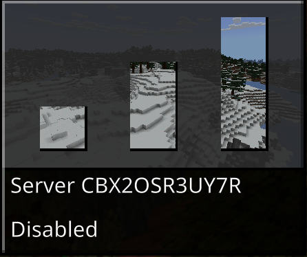
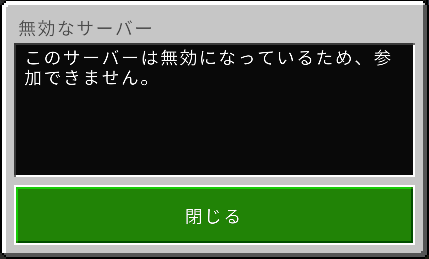
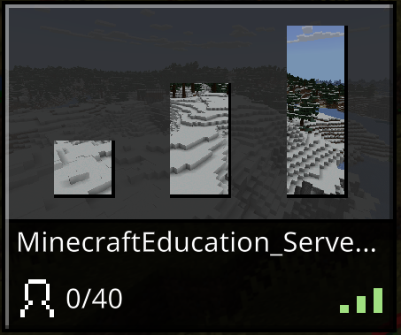

# Minecraft Education Edition Dedicated Server - Docker

Docker環境でMinecraft Education Edition Dedicated Serverを実行します。

> **注意**: ベータ版（v1.21.110）を使用しています。

## システム要件

- Docker & Docker Compose
- 2コア以上のCPU、1GB以上のRAM
- Azure AD グローバル管理者権限（初回認証とサーバー管理に必要）

## クイックスタート

### 1. 環境設定

`.env`ファイルを編集（**必須**）：

```bash

# 公開IPアドレス（必須設定）
SERVER_PUBLIC_IP=192.168.1.100
# 例1（LAN内のみ）: dockerホストのIPアドレス
# 例2（インターネット公開）: グローバルIPアドレスまたはドメイン名


# ポート番号（必須設定）
SERVER_PORT_WORLD_1=19132
# 必ず設定してください。未設定の場合はエラーになります
# セキュリティ上、デフォルトポート19132以外を推奨（例: 19142）

# IPv6ポート（任意設定）
#SERVER_PORTV6_WORLD_1=19133
# IPv6を使用する場合のみ設定
```

### 2. サーバー起動

```bash
# ビルドと起動
docker-compose build
docker-compose up -d

# 初回認証（Device Codeを確認）
docker-compose logs -f minecraft-edu-world1
```

### 3. サーバー有効化

**重要**: サーバー起動後、[Python Notebook](https://aka.ms/MCEDU-DS-Tooling)で`Enabled=True`に設定する必要があります。

```python
# tooling/edit_server_info セルで実行
{
    "Enabled": True,
    "ServerName": "My Server",
    "IsBroadcasted": False
}
```

詳細は[公式ガイド](https://edusupport.minecraft.net/hc/en-us/articles/41757415076884)を参照してください。

## ディレクトリ構成

```
.
├── Dockerfile              # Ubuntu 22.04ベースのコンテナイメージ定義
├── docker-compose.yml      # サービス定義（単一/複数ワールド対応）
├── entrypoint.sh           # 起動スクリプト（設定ファイル自動生成）
└── .env                    # 環境変数設定（全設定を管理・要編集）
```

## 設定管理

すべての設定は`.env`ファイルで管理します。設定変更後は`docker-compose restart`で反映されます。
「ワールド作成後に変更しても反映されるもの」と「一度生成したら反映されない（または部分的にしか反映されない）もの」があります。

詳細な設定項目は`.env`ファイルを参照してください。

## 複数ワールド運用

### ワールド追加手順

1. **docker-compose.ymlのテンプレートをコピー**
   ```yaml
   # ファイル末尾の「ワールド追加用テンプレート」をコピー
   ```

2. **{N}を実際の番号に置換**
   - エディタの「検索・置換」機能で `{N}` → `2` に一括置換
   - 例: `minecraft-edu-world{N}` → `minecraft-edu-world2`

3. **.envにポート番号を設定（必須）**
   ```bash
   # .env
   SERVER_PORT_WORLD_2=19134  # 必須: World1とは異なるポート番号
   #SERVER_PORTV6_WORLD_2=19135  # 任意: IPv6を使用する場合のみ
   ```

4. **コンテナを起動**
   ```bash
   docker-compose up -d minecraft-edu-world2
   ```

### 3段階フォールバック設定

設定の優先順位：**個別設定 > 共通設定 > デフォルト値**

#### 例: ゲームモードの設定

**シナリオ**: World1はクリエイティブ、World2以降は全てサバイバル

```bash
# .envファイル
GAMEMODE_COMMON=creative       # 全ワールドのデフォルト
GAMEMODE_WORLD_1=survival      # World1だけ個別設定
# GAMEMODE_WORLD_2は未設定 → GAMEMODE_COMMONが使われる
```

**結果**:
- **World1** → `survival`（個別設定が優先）
- **World2以降** → `creative`（共通設定を使用）
- **すべて未設定の場合** → docker-compose.ymlのデフォルト値を使用

## コマンド

```bash
# ログ確認
docker-compose logs -f minecraft-edu-world1

# 設定変更反映
docker-compose restart

# 停止
docker-compose down

# 完全削除（ワールドデータも削除）
docker-compose down -v
```

## トラブルシューティング

### 1. サーバーに接続できない

#### 症状: サーバーIDを入力しても接続できない



#### 原因と対処法

**原因1: サーバーが有効化されていない（Enabled=False）**



**対処法**: [Python Notebook](https://aka.ms/MCEDU-DS-Tooling)で`Enabled=True`に設定

```python
# tooling/edit_server_info セルで実行
{
    "Enabled": True,
    "ServerName": "My Server",
    "IsBroadcasted": False
}
```

有効化後は接続成功します：



**原因2: ポート設定またはファイアウォールの問題**


**対処法**:
1. **サーバーログで接続情報を確認**
   ```bash
   docker-compose logs minecraft-edu-world1 | grep "port:"
   # 出力例: IPv4 supported, port: 192.168.1.100:19132
   ```
   このIPアドレスとポート番号でクライアントから接続できるか確認
2. **.envの設定確認**
   - `SERVER_PUBLIC_IP`: DockerホストのIPアドレス（LAN内ならプライベートIP、インターネット経由ならパブリックIP/ドメイン）
   - `SERVER_PORT_WORLD_1`と`SERVER_PORTV6_WORLD_1`: ポート番号が設定されているか
3. **ファイアウォール確認**: 該当ポートのUDPが開放されているか
4. **ルーター/NAT確認**（インターネット経由の場合）: ポートフォワーディングが設定されているか

## 管理ツール

- **[IT管理ポータル](https://aka.ms/dedicatedservers)** - テナント設定（機能有効化）
- **[サーバー管理ツール（Python Notebook）](https://aka.ms/MCEDU-DS-Tooling)** - サーバー詳細設定

## 参考資料

- [Dedicated Server 101](https://edusupport.minecraft.net/hc/en-us/articles/41758309283348)
- [インストールガイド](https://edusupport.minecraft.net/hc/en-us/articles/41757415076884)
- [API ドキュメント](https://aka.ms/MCEDU-DS-Docs)

## ライセンス

リポジトリのコード: Apache License 2.0

Minecraft Education Edition サーバーバイナリ: [Microsoft Software License Terms](https://aka.ms/MinecraftEULA)
